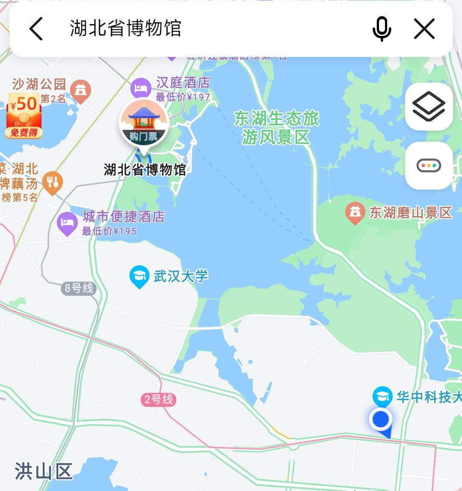

## 史纲课外教学实践
### ---近代及新中国教育变迁(以武汉大学为例)
***
### *Basic Plan*
**活动内容**：参观武汉大学及其校史馆，以文字图片方式进行记录，主要聚焦文化教育方面的变迁。
**时间**：暂定4.3(Sun.)。
**地点**：武汉大学
**出行计划**：地铁2号线为主？(具体进校路线交给周神了)
**其他**
1. 出发时间未定
2. 当天需完成所有内容收集。
3. 少说多做，办完事情再嗨皮
***
### *Some Situation*
1. 遇到疫情或者天气因素则暂缓计划
2. 若无法进入武大(周神一定不会让这种事发生的吧,莫？)，则改变主题，及时转8号线前往湖北省博物馆收集一些资料。 

***
### *Task Assignment*

活动计划记录：虞
具体内容：孟，杨，周
总结：韩