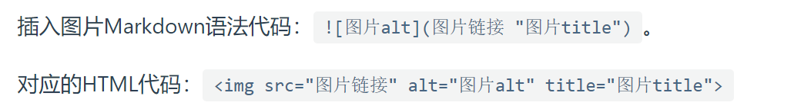

# 教程链接：<https://markdown.com.cn/>

# 标题语法
easy

# 段落语法
<p>可以用html标记语言的段落？</p>
<p>可以！其他也都可以！</p>

# 换行语法
两种方式：空格换行与br标签换行

# 强调语法
## 粗体(三种方式)：
我喜欢**粗体**。<br>
我喜欢 __粗体__。(不推荐使用,有空格问题)<br>
我喜欢<strong>粗体</strong>。
## 斜体(三种方式，建议同上)：
使用*斜体*<br>
使用 _斜体_<br>
使用<em>斜体</em>
## 粗斜体
同样的，可以用***，___和em&strong<br>
这是<em><strong>粗斜体</strong></em><br>
这是<strong><em>粗斜体</em></strong>

# 引用
><p>这是引用</p>

>多段引用
>
>多段引用<br>

> #### 嵌套引用
>
>>就像这样

# 列表语法
1. first
2. second
3. 注意要有空格，数字顺序无关，从1开始
<ol>
<li>这样也可以</li>
<li>这样也可以</li>
<li>把ol去掉就以‘·’开头了</li>
</ol>

# 代码语法
单句语法使用`反引号`<br>
``想单纯使用反引号，要用双反引号 `用法` ``

代码块语法，建议使用围栏式：<br>
```python
for i in range(1, 100):
    print(i)
```

# 分割线语法
***
---
___

# 链接语法
## md语法：
这是一个链接：[百度](https://www.baidu.com)<br>
我们加上链接显示名称： [百度](https://www.baidu.com "跳转到百度")<br>
一种简单的写法：<https://www.baidu.com>,不能指定名称，邮箱也适用
## html语法
一个链接：<a href="https://www.baidu.com" title="跳转到百度">百度</a>
## 其他
强调链接和引用链接见<https://markdown.com.cn/basic-syntax/links.html>

# 图片语法
图片(两种实现方式)：<br>
<br>
<br>

图片还可以包含链接：<br>
[](https://markdown.com.cn/basic-syntax/images.html)

# 转义字符语法
有点繁，看看教程：<https://markdown.com.cn/basic-syntax/escaping-characters.html>

