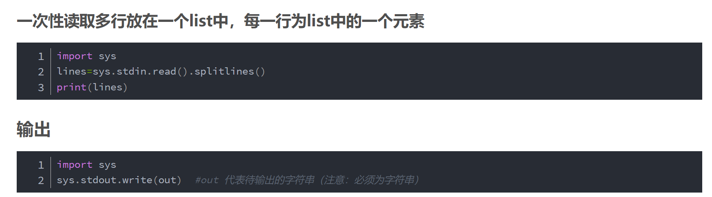

### 常用技巧杂汇
[汇总1](https://blog.csdn.net/luoyangIT/article/details/109121692?ops_request_misc=%257B%2522request%255Fid%2522%253A%2522164257334516780269838129%2522%252C%2522scm%2522%253A%252220140713.130102334..%2522%257D&request_id=164257334516780269838129&biz_id=0&utm_medium=distribute.pc_search_result.none-task-blog-2~all~sobaiduend~default-2-109121692.pc_search_insert_es_download&utm_term=python%E5%88%B7%E9%A2%98%E6%8A%80%E5%B7%A7&spm=1018.2226.3001.4187)
[汇总2](https://blog.csdn.net/qq_39575835/article/details/113459025?ops_request_misc=%257B%2522request%255Fid%2522%253A%2522164257334516780269838129%2522%252C%2522scm%2522%253A%252220140713.130102334..%2522%257D&request_id=164257334516780269838129&biz_id=0&utm_medium=distribute.pc_search_result.none-task-blog-2~all~baidu_landing_v2~default-3-113459025.pc_search_insert_es_download&utm_term=python%E5%88%B7%E9%A2%98%E6%8A%80%E5%B7%A7&spm=1018.2226.3001.4187)
[汇总3](https://blog.csdn.net/qsmx666/article/details/115433624?ops_request_misc=%257B%2522request%255Fid%2522%253A%2522164257334516780269890264%2522%252C%2522scm%2522%253A%252220140713.130102334.pc%255Fall.%2522%257D&request_id=164257334516780269890264&biz_id=0&utm_medium=distribute.pc_search_result.none-task-blog-2~all~first_rank_ecpm_v1~rank_v31_ecpm-7-115433624.pc_search_insert_es_download&utm_term=python%E5%88%B7%E9%A2%98%E6%8A%80%E5%B7%A7&spm=1018.2226.3001.4187)
[汇总4](https://blog.csdn.net/Whisper321/article/details/96505219?ops_request_misc=%257B%2522request%255Fid%2522%253A%2522164257334516780269890264%2522%252C%2522scm%2522%253A%252220140713.130102334.pc%255Fall.%2522%257D&request_id=164257334516780269890264&biz_id=0&utm_medium=distribute.pc_search_result.none-task-blog-2~all~first_rank_ecpm_v1~rank_v31_ecpm-8-96505219.pc_search_insert_es_download&utm_term=python%E5%88%B7%E9%A2%98%E6%8A%80%E5%B7%A7&spm=1018.2226.3001.4187)
***

### 杂项
#### 取模问题
[理论](https://www.jianshu.com/p/452c1a5acd31)
[整除和取模正负数不同](https://blog.csdn.net/u012626619/article/details/80671233)

#### 小数百分数格式化
小数位数控制：`sum = format(4*sum,".8f")`  
[百分数控制](https://blog.csdn.net/u013553529/article/details/78567696)

#### 一些方便的语法
 
两个list用加号连接，返回一个合并后的list

#### 增加递归层数限制
[增加层数](https://blog.csdn.net/weixin_44851971/article/details/106678010?ops_request_misc=%257B%2522request%255Fid%2522%253A%2522164483602316780269811555%2522%252C%2522scm%2522%253A%252220140713.130102334..%2522%257D&request_id=164483602316780269811555&biz_id=0&utm_medium=distribute.pc_search_result.none-task-blog-2~all~baidu_landing_v2~default-1-106678010.pc_search_insert_ulrmf&utm_term=python%E5%A2%9E%E5%8A%A0%E9%80%92%E5%BD%92%E6%AC%A1%E6%95%B0&spm=1018.2226.3001.4187)

#### gcd和lcm
[lcm可以由gcd实现](https://blog.csdn.net/culing2941/article/details/108617600)
[求多个数的gcd和lcm](https://zhuanlan.zhihu.com/p/352261722)

#### counter和count函数用法
[counter](https://blog.csdn.net/qwe1257/article/details/83272340)
[count](https://blog.csdn.net/JNingWei/article/details/78308815)

#### 排列组合函数(列出所有排列或组合)
[用法](https://zhuanlan.zhihu.com/p/473353113)
这里提供排列组合数的计算：
`math.comb(n, k)`
排列数则在组合数的基础上乘`k!`

3.8新增排列函数：`math.perm(n, k)`

#### 内置二分查找函数(有点鸡肋)
[用法](https://blog.csdn.net/XianZhe_/article/details/114392515)

#### dict遍历
[用法](https://blog.csdn.net/qdPython/article/details/121142688)

#### 删除列表元素
[用法](http://c.biancheng.net/view/2209.html)
[list转字符串](https://blog.csdn.net/weixin_53185043/article/details/117336560)

***

### 数据结构
#### 字典
[字典相关操作](https://blog.csdn.net/qq_30022055/article/details/106321175?ops_request_misc=%257B%2522request%255Fid%2522%253A%2522164411596016780357224015%2522%252C%2522scm%2522%253A%252220140713.130102334..%2522%257D&request_id=164411596016780357224015&biz_id=0&utm_medium=distribute.pc_search_result.none-task-blog-2~all~top_click~default-3-106321175.pc_search_insert_es_download&utm_term=python%E5%AD%97%E5%85%B8&spm=1018.2226.3001.4187)
[字典get方法方便字典本来不存在的键的初始化](https://www.runoob.com/python/att-dictionary-get.html)
***

### 标准IO
#### input方法

#### sys方法

#### 文件读写
[文件读写](https://zhuanlan.zhihu.com/p/78330811)
[实战技巧](https://zhuanlan.zhihu.com/p/87789408#:~:text=%E5%A6%82%E6%9E%9C%E4%B8%8D%E6%98%AF%E6%B7%B1%E5%85%A5%E7%9A%84%E6%93%8D%E4%BD%9C%E6%96%87%E4%BB%B6%E6%95%B0%E6%8D%AE%EF%BC%8C%E6%8C%89%E8%A1%8C%E8%AF%BB%E3%80%81%E5%86%99%E6%98%AF%E6%9C%80%E9%80%9A%E7%94%A8%E7%9A%84%E6%96%B9%E5%BC%8F%E3%80%82%20%E5%9C%A8Python%E4%B8%AD%EF%BC%8Creadline,%28%29%E5%87%BD%E6%95%B0%E5%8F%AF%E4%BB%A5%E4%B8%80%E6%AC%A1%E8%AF%BB%E5%8F%96%E4%B8%80%E8%A1%8C%EF%BC%8C%E4%B8%94%E6%AF%8F%E6%AC%A1%E9%83%BD%E6%98%AF%E5%89%8D%E8%BF%9B%E5%BC%8F%E7%9A%84%E8%AF%BB%E5%8F%96%E4%B8%80%E8%A1%8C%EF%BC%8C%E8%AF%BB%E5%88%B0%E6%96%87%E4%BB%B6%E7%BB%93%E5%B0%BE%E7%9A%84%E6%97%B6%E5%80%99%E4%BC%9A%E8%BF%94%E5%9B%9E%E7%A9%BA%E5%AD%97%E7%AC%A6%E4%B8%B2%E3%80%82%20readline%20%28%29%E7%9A%84%E6%93%8D%E4%BD%9C%E5%B0%B1%E5%83%8F%E6%98%AF%E6%9C%89%E4%B8%80%E4%B8%AA%E6%8C%87%E9%92%88%EF%BC%8C%E6%AF%8F%E6%AC%A1%E8%AF%BB%E5%AE%8C%E4%B8%80%E8%A1%8C%E5%B0%B1%E5%B0%86%E6%8C%87%E9%92%88%E6%8C%87%E5%90%91%E9%82%A3%E4%B8%80%E8%A1%8C%E7%9A%84%E5%90%8E%E9%9D%A2%E5%81%9A%E4%B8%8B%E6%A0%87%E8%AE%B0%EF%BC%8C%E4%BB%A5%E4%BE%BF%E4%B8%8B%E6%AC%A1%E8%83%BD%E4%BB%8E%E8%BF%99%E9%87%8C%E5%BC%80%E5%A7%8B%E7%BB%A7%E7%BB%AD%E5%90%91%E5%90%8E%E8%AF%BB%E5%8F%96%E4%B8%80%E8%A1%8C%E3%80%82)

#### format格式化输出

[format](https://www.runoob.com/python/att-string-format.html)

#### 计算程序运行时间

[(23条消息) python计算程序的运行时间的方法(python程序，jupyter)_ykf173的博客-CSDN博客_python 计算运行时间](https://blog.csdn.net/ykf173/article/details/105374383?utm_source=app&app_version=5.3.0&utm_source=app)

#### zip函数

[Python zip() 函数 | 菜鸟教程 (runoob.com)](https://www.runoob.com/python/python-func-zip.html)

#### enumerate函数

[Python enumerate() 函数 | 菜鸟教程 (runoob.com)](https://www.runoob.com/python/python-func-enumerate.html)